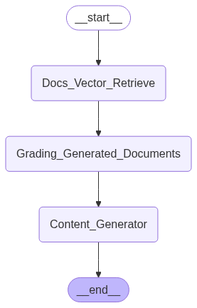

# AgenticRAG - Cybersecurity Document Retrieval-Augmented Generation System

 RAG (Retrieval-Augmented Generation) system designed for cybersecurity document analysis, built with LangGraph for advanced workflow orchestration and agentic behavior.

## 🏗️ Architecture

This system implements an **Agentic RAG architecture** that goes beyond simple retrieval-generation patterns. The system uses intelligent agents to grade document relevance, validate responses, and ensure high-quality outputs through a multi-step workflow.

### Core Components:

- **Document Processing Pipeline**: Loads and chunks NIST cybersecurity documents with intelligent header/footer cleaning
- **Vector Database**: Persistent ChromaDB storage for document embeddings
- **Retrieval System**: Semantic search with configurable similarity thresholds
- **Agentic Workflow**: LangGraph-based state machine with intelligent routing
- **Grading Agents**: Automated quality assessment of retrieved documents and generated responses
- **Interactive Interface**: Streamlit-based chat interface with conversation management

## 🔄 System Flow

The system follows an intelligent agentic workflow that ensures high-quality responses through multiple validation stages:




## Graph Components 

### Nodes:
- **🔍 Retrieve**: Fetches relevant documents from vector database
- **📋 Grade Documents**: Evaluates document relevance to the question
- **💭 Generate**: Creates answers using retrieved context
- **🔄 Transform Query**: Rewrites questions for better retrieval

### Workflow:
1. **Start** → Question received
2. **Retrieve** → Search vector database for relevant documents
3. **Grade** → Evaluate if documents are relevant
4. **Decision** → Route based on document quality
5. **Generate** → Create final answer or transform query
6. **End** → Return response to user
### Intelligent Routing:
- **Document Quality Gates**: Only high-quality, relevant documents proceed to generation
- **Fallback Mechanisms**: Re-retrieval if document quality is insufficient
- **Source Attribution**: Maintains traceability to original NIST documents

## 🛠️ DEMO

https://github.com/user-attachments/assets/42a15dcb-b013-44c7-8d3c-05917d1426b0


## 🛠️ Technology Stack & Rationale

### **Embeddings: HuggingFace Transformers**
**Model**: `all-MiniLM-L6-v2`

**Why HuggingFace:**
- ✅ **Cost Efficiency**: No API costs for embedding generation
- ✅ **Offline Capability**: Works without internet connectivity
- ✅ **Performance**: 384-dimension embeddings provide good balance of quality vs. speed


### **Vector Database: ChromaDB**
**Why ChromaDB:**
- ✅ **Simplicity**: Easy to set up and manage without complex infrastructure
- ✅ **Integration**: Native LangChain integration with minimal setup
- ✅ **Persistence**: Built-in disk persistence without additional configuration
- ✅ **Local Deployment**: No external dependencies or cloud requirements
- ✅ **Performance**: Excellent for document collections up to millions of entries
- ✅ **Resource Efficiency**: Lower memory footprint compared to FAISS for persistent storage
- ✅ **Development Friendly**: SQLite backend makes debugging and inspection easy

### **LLM Backend: Ollama (Llama 3.2)**
**Why Ollama:**
- ✅ **Local Inference**: No external API dependencies 
- ✅ **Cost Control**: No per-token charges ( No money, big wow ! )
- ✅ **Performance**: Optimized for local GPU/CPU inference


### **UI Framework: Streamlit**
**Why Streamlit over React/Angular:**
- ✅ **Rapid Development**: Python-native, no JavaScript required
- ✅ **Data Science Integration**: Native support for charts, dataframes, and ML workflows
- ✅ **Prototyping Speed**: From concept to working interface in hours
- ✅ **Caching**: Built-in caching for expensive operations (embeddings, model loading)
- ✅ **Deployment**: Simple containerization and cloud deployment
- ✅ **Focus on Function**: Less time on UI engineering, more on RAG functionality
- ❌ **Trade-off**: Less customizable than React, but sufficient for internal tools

### **Orchestration: LangGraph**
**Why LangGraph:**
- ✅ **Agentic Workflows**: Purpose-built for complex AI agent orchestration
- ✅ **State Management**: Robust state machines for multi-step AI workflows
- ✅ **Debugging**: Visual workflow graphs and step-by-step execution tracking
- ✅ **Flexibility**: Easy to modify workflow logic and add new agents
- ✅ **Integration**: Seamless with LangChain ecosystem

The choice of technologies has other advantages that we haven't talked about, but in the case of this project they don't matter.
## 📦 Installation & Setup

### Option 1: Docker Deployment (Recommended)

**Prerequisites:**
- Docker and Docker Compose
- At least 8GB RAM available for containers
- GPU support optional but recommended for better performance

**Quick Start:**
```bash
# Clone the repository
git clone <repository-url>
cd AgenticRAG/docker

# Start the system
docker-compose up --build

# Access the application
# http://localhost:8501
```

**What Docker does:**
1. 🐳 Builds the Python environment with all dependencies
2. 🦙 Installs and configures Ollama with Llama 3.2 model
3. 📚 Initializes vector database with NIST documents
4. 🚀 Starts Streamlit interface on port 8501

**First-time setup takes 10-15 minutes** (downloads Llama 3.2 model ~2GB)

### Option 2: Local Development Setup

**Prerequisites:**
- Python 3.11+
- 16GB+ RAM recommended
- CUDA-compatible GPU (optional)

**Installation Steps:**

1. **Clone and setup environment:**
```bash
git clone <repository-url>
cd AgenticRAG
python -m venv venv
source venv/bin/activate  # or `venv\Scripts\activate` on Windows
```

2. **Install dependencies:**
```bash
pip install -r requirements.txt
```

3. **Install and setup Ollama:**
```bash
# Install Ollama (see https://ollama.ai for OS-specific instructions)
ollama pull llama3.2
ollama serve  # Keep this running in a separate terminal
```

4. **Initialize vector database:**
```bash
python scripts/initialize_vectordb.py
```

5. **Run the application:**
```bash
streamlit run src/app.py
```

## 🚀 Usage

### Basic Usage:
1. Open http://localhost:8501 in your browser
2. Ask questions about cybersecurity topics from NIST documents
3. View responses with source citations
4. Explore conversation history in the sidebar

### Example Queries:
- "What are the six core functions of the NIST Cybersecurity Framework?"
- "How should organizations handle security incidents?"
- "What are the key security controls for access management?"
- "What is the incident response lifecycle?"
- "How to implement risk assessment procedures?"

### Advanced Features:
- **Conversation Management**: Multiple chat sessions with automatic titling
- **Source Attribution**: Every response shows source documents with page numbers
- **Conversation History**: Persistent chat history across sessions
- **Example Prompts**: Pre-loaded questions to get started quickly

## 📊 Performance & Specifications

### **Document Collection:**
- **4 NIST Documents**: CSWP.29, SP.800-53r5, SP.800-61r3, SP.800-61r2
- **652 Source Pages** processed into **2,126 chunks**
- **53MB Vector Database** with 384-dimensional embeddings

### **Response Quality:**
- **Relevance Filtering**: Only documents scoring >0.7 relevance used for generation
- **Source Attribution**: All responses include document references with page numbers
- **Context Window**: Optimized chunk size (400 tokens) for precise retrieval

### **Performance Metrics:**
- **Cold Start**: ~30 seconds (model loading)
- **Query Response**: 3-8 seconds (depending on complexity)
- **Vector Search**: <1 second for similarity search
- **Memory Usage**: ~4GB RAM for full system operation

## 🔧 Configuration

### **Environment Variables:**
```bash
STREAMLIT_SERVER_PORT=8501
STREAMLIT_SERVER_ADDRESS=0.0.0.0
OLLAMA_HOST=0.0.0.0:11434
PYTHONPATH=/app:/app/src
```

### **Customization Options:**
- **Models**: Change LLM model in `src/config.py`
- **Retrieval**: Adjust similarity threshold and top-k in `src/agents/nodes.py`
- **Chunking**: Modify chunk size in `src/data_preprocess/document_loader.py`
- **UI**: Customize interface in `src/app.py`

## 📁 Project Structure

```
AgenticRAG/
├── src/
│   ├── agents/           # LangGraph workflow definitions
│   ├── data_preprocess/  # Document loading and processing
│   ├── app.py           # Streamlit interface
│   ├── main.py          # RAG system setup
│   └── config.py        # Model and path configuration
├── data/
│   ├── documents/       # NIST PDF documents
│   ├── cache/          # Processed document cache
│   └── chroma_db/      # Vector database
├── scripts/
│   └── initialize_vectordb.py  # Database setup script
├── docker/
│   ├── Dockerfile
│   ├── docker-compose.yml
│   └── docker-entrypoint.sh
└── docs/               # Documentation and diagrams
```

## 🔍 Troubleshooting

### **Common Issues:**

**"Failed to initialize RAG system"**
- Ensure Ollama is running and accessible
- Check if vector database was properly initialized
- Verify all dependencies are installed

**"No relevant documents found"**
- Try rephrasing your question
- Ensure your question relates to cybersecurity topics
- Check if documents were properly loaded

**"Connection refused (Ollama)"**
- Verify Ollama service is running: `ollama serve`
- Check if Llama 3.2 model is installed: `ollama list`
- Ensure port 11434 is not blocked

### **Performance Optimization:**
- **GPU Acceleration**: Configure Ollama for GPU usage
- **Memory**: Increase Docker memory allocation if running in containers
- **Concurrent Users**: Adjust Streamlit settings for multiple users

## 🤝 Contributing

1. Fork the repository
2. Create a feature branch
3. Make your changes
4. Add tests if applicable
5. Submit a pull request

## 📄 License

[Add your license information here]

## 🙏 Acknowledgments

- **NIST**: For providing comprehensive cybersecurity documentation
- **LangChain/LangGraph**: For the agent orchestration framework
- **ChromaDB**: For the vector database solution
- **Ollama**: For local LLM inference capabilities
- **Streamlit**: For rapid UI development
